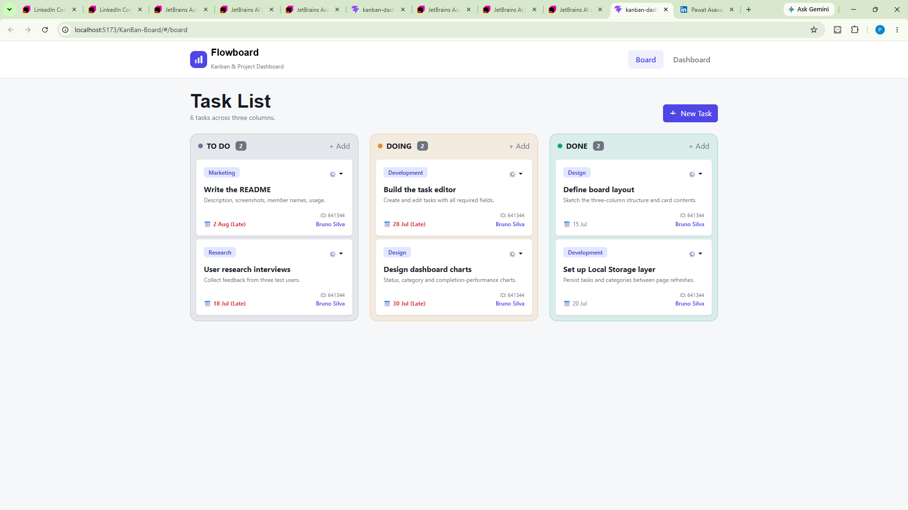
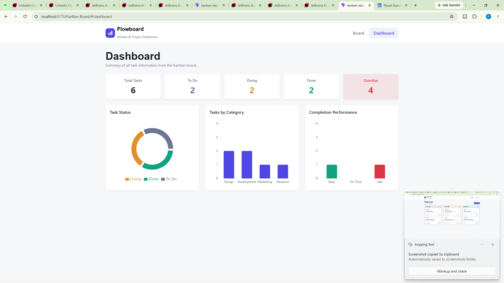
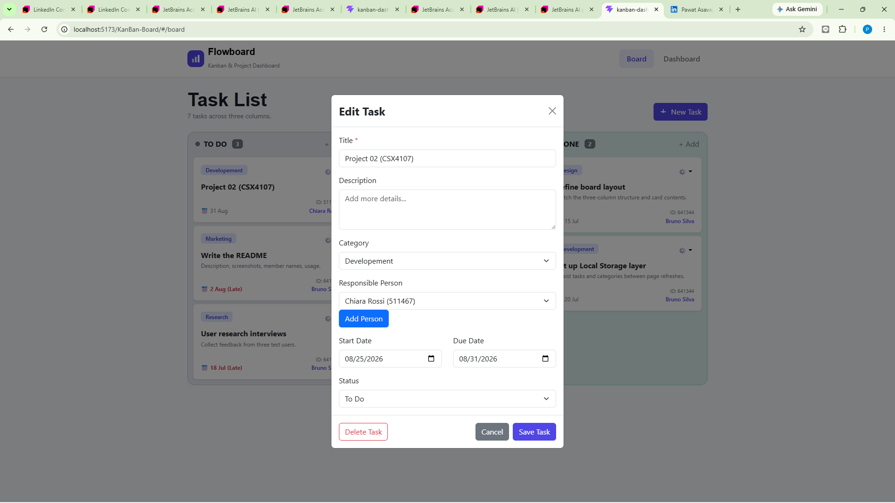
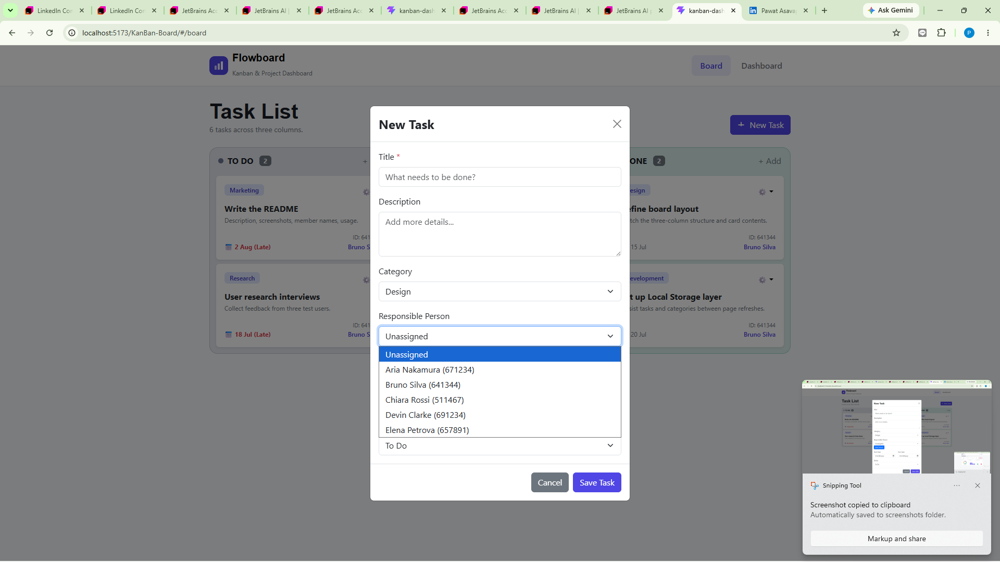

# CSX/ITX4107 Project 01 (KanBan-DashBoard) 
A multi page application for managing task on a three -column Kanban board, paried with a dashboard that summarizes task activity through activity cards and charts. All data is stored in the browser's Local Storage - there is no backend.

# Team Members
1. Pawat Asavapotiphan 6714522
2. Napatra Hanwari 6711232

## Project Description
This app lets a small team organize work visually and tack progress at a glace. It is split into two pages: 
+ **KanBan Board -** A board with three columns (To Do, Doing, and Done). Each task shows its tile, category, responsible person and a category. When a task is moved to Done, its complete date is recorded so completion performance can be measured. 

+ **Dashboard -** A summary view of everything on the board: 
  + ***Summary Cards*** for total tasks, To Do, Doing, Done, and overdue tasks.
  + ***Task Status Chart (pie/doughnut)*** showing how tasks are distributed across To Do, Doing, and Done. 
  + ***Task Category chart (bar)*** showing how many tasks fall into each category. 
  + ***Completion PErformance Chart*** comparing tasks completed Early (before due date), On Time (0n due date), and Late(after due date). 

Each tasks stores a title, description, category, start date, due date, complete date, responsible person, and status. Categories can be chosen from an existing list or created on the fly, and any new category becomes availabel for future tasks. Both tasks and categories persist in Local Storage, so refreshing the page keeps your data. 

The list of responsible people is provided as seed data -- person management is intentionally out of scope. 

## Live Demo
  + ***Github Pages:***
  + ***Repository:***

## Usage Instructions
  + ***Managing Tasks***
    1. On the Kanban Board page, click New Task to open the task form.
    2. Fill in the title, description, responsible person, start date, and due date. Pick a category from the dropdown, or type a new one to add it. 
    3. Click Save to place the task in the To Do column.
    4. To move a task, change its status (or drag it) between To Do, Doing, and Done. When a task reaches Done, set its complete date.
    5. To edit a task, open it and adjust any field. To delete it, use the Delete button shown in edit mode.

  + ***Viewing the dashboard***
    1. Open the Dashboard page to see the summary cards and the tree charts (status, category, and completion performance). These update automatically from the current board.

  + ***Data Persistence***
    1. All tasks and categories are saved to your browser's Local Storage. Refreshing or reopening the page restores your previous data. To start fresh, clear the site's Local Storage in your browser.

## Screenshots

